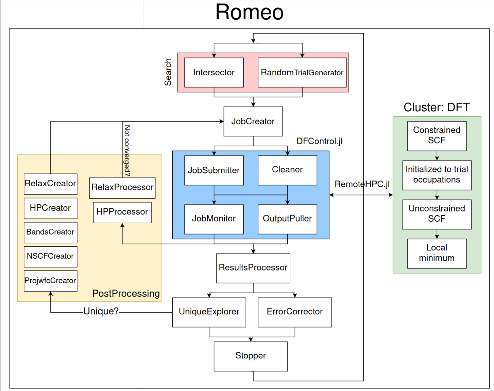

# RomeoDFT

Software package to perform **R**obust **O**ccupation **M**atrix **E**nergy **O**ptimization using DFT.
At this moment it is based on the implementation of occupation matrix constraining in [a patched version of Quantum Espresso](https://gitlab.com/louisponet/q-e/-/tree/broyden_constraints).

See [Documentation](https://louisponet.github.io/RomeoDFT.jl/dev) for more information.

## Architecture

